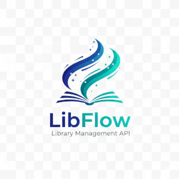

# 📚 LibFlow API


> A modern, high-performance Library Management System Backend

LibFlow is a RESTful API designed to streamline library operations. 
It handles complex book inventories, user borrowing lifecycles, and integrated 
payment tracking for a seamless library experience.

### 🌟 Key Features:
* **Book Management:** Categorized inventory tracking with support for 
hard/soft covers and daily rental fee calculations.
* **Automated Borrowing System:** Smart validation prevents borrowing books 
with zero inventory or setting return dates in the past.
* **Payment Integration:** Supports fine tracking and payment status 
(Pending/Paid) for overdue books.
* **User System:** Secure JWT-based authentication with differentiated access 
for staff (Librarians) and regular users (Readers).
* **Automated Notifications:** Integration with Telegram about new borrowing, 
book returns, and payments using Celery.

### 🏗️ Architecture
The project follows a clean, modular Django architecture:

* **User App:** Custom user model using Email as the primary identifier.
* **Books App:** Manages the library catalog and inventory.
* **Borrowings App:** The core logic engine managing the relationship between users, books, and return dates.
* **Payments App:** Tracks financial transactions and fine calculations.

## 🚀 Getting Started

### Prerequisites
Ensure you have the following installed:
* Python (3.11+)
* Docker & Docker Compose
* Git

#### 1. Clone the repository
```shell
  git clone https://github.com/Slava-Nykonenko/libflow-api.git
  cd libflow-api
  python -m venv venv
```
#### For Windows:
```shell
  venv\Scripts\activate
```
#### For Mac/Linux:
```shell
  source venv/bin/activate
```

#### 2. Run with Docker (Recommended)
Docker should be installed.

```shell
  docker-compose up --build
```

#### 3. Manual Installation (Development)

If running locally without Docker, ensure you have PostgreSQL and Redis 
running on your machine.
```shell
  python -m venv venv
  # Windows: venv\Scripts\activate | Mac/Linux: source venv/bin/activate
  pip install -r requirements.txt
  
  # Configure your environment (create a .env file or export variables)
```
Configure your environment (create a `.env` file using the `.env.sample` file in 
the root directory).

_**Note:** To use scheduling features locally, you must also start a worker: 
`celery -A libflow-api worker -l info`_

#### DockerHub Image

You can pull the prebuilt image directly from DockerHub:

```shell
  docker pull slavanykonenko/libflow-api:latest
```

#### 🔐 Authentication & API Usage
The API uses SimpleJWT for secure access.
1. Obtain Token: `POST /api/user/token/`
2. Authorize: Include the token in your headers: 
`Authorization: Bearer <your_access_token>`

### 📖 Documentation
This project uses DRF Spectacular to automatically generate an OpenAPI 3.0 
(Swagger) schema.

**Raw Schema:**  
[http://127.0.0.1:8000/api/schema/](http://127.0.0.1:8000/api/schema/)

**Swagger UI:**<br>
View the interactive API documentation at: 
[http://127.0.0.1:8000/api/schema/swagger/](http://127.0.0.1:8000/api/schema/swagger/)

**Redoc:**<br>
View the clean, reference-style documentation at: 
[http://127.0.0.1:8000/api/schema/redoc/](http://127.0.0.1:8000/api/schema/redoc/)

  
## 🤝 Contributing
1. Fork the Project
2. Create your Feature Branch (git checkout -b feature/AmazingFeature)
3. Commit your Changes (git commit -m 'feat: Add some AmazingFeature')
4. Push to the Branch (git push origin feature/AmazingFeature)
5. Open a Pull Request

## 👤 Author
Viacheslav Nykonenko<br>
[slava.nykon@gmail.com](mailto:slava.nykon@gmail.com)<br>
[GitHub](https://github.com/Slava-Nykonenko) |
[DockerHub](https://hub.docker.com/repositories/slavanykonenko) |
[LinkedIn](https://www.linkedin.com/in/viacheslav-nykonenko-49211b316/)<br>
+353 85 222 1534 <br>
Carlow, Ireland

## 🔗 Links

- Repository: [GitHub](https://github.com/Slava-Nykonenko/libflow-api)
- In case of sensitive bugs like security vulnerabilities, please contact
slava.nykon@gmail.com directly. We value your effort to improve the security 
and privacy of this project!
- Related projects:
  - [Statusphere](https://github.com/Slava-Nykonenko/statusphere)
  - [Emerald Railroads](https://github.com/Slava-Nykonenko/emerald-railroads)
  - [Skyway Airlines](https://github.com/Slava-Nykonenko/skyway-airlines)

## 📄 Licensing
The code in this project is licensed under [MIT license](LICENSE.txt).
